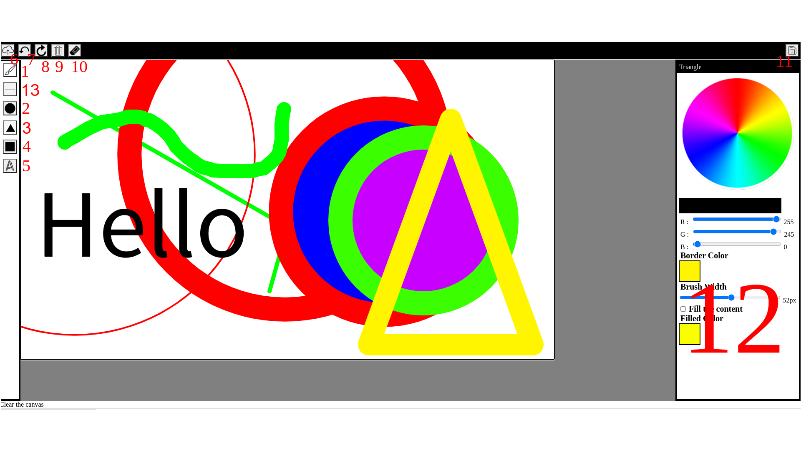
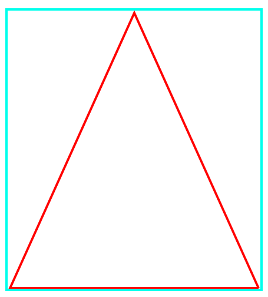

# Software Studio 2020 Spring
## Assignment 01 Web Canvas

### Scoring

| **Basic components**                             | **Score** | **Check** |
| :----------------------------------------------- | :-------: | :-------: |
| Basic control tools                              | 30%       | Y         |
| Text input                                       | 10%       | Y         |
| Cursor icon                                      | 10%       | Y         |
| Refresh button                                   | 10%       | Y         |

| **Advanced tools**                               | **Score** | **Check** |
| :----------------------------------------------- | :-------: | :-------: |
| Different brush shapes                           | 15%       | Y         |
| Un/Re-do button                                  | 10%       | Y         |
| Image tool                                       | 5%        | Y         |
| Download                                         | 5%        | Y         |

| **Other useful widgets**                         | **Score** | **Check** |
| :----------------------------------------------- | :-------: | :-------: |
| Name of widgets                                  | 1~5%     | N         |

---

### How to use 

### 左方工具列

1. Brush(筆刷) ：可繪製不規則線條，可調整顏色、筆寬
2. Circle(圓) ：可繪製圓形，按下去時為圓心。可調整顏色、筆寬、填充色彩
3. Triangle(三角形)：可繪製三角形，按下去時為下圖的左上角，放開為右下角，由下而上拖動鼠標會形成倒三角形。可調整顏色、筆寬、填充色彩
4. Rectangle(長方形)：可繪製長方形，按下去時為長方形的左上角，放開為右下角，點選位置，會出現'__'，輸入完畢後按"Enter"確認。可調整顏色、筆寬、填充色彩
5. Text(文字)：可輸入文字，只能是英文字及數字。可調整字的顏色、大小、字形

### 上方Menu選單

6. Upload(上傳圖片)：可上傳圖片並編輯
7. Redo：復原
8. Undo：取消復原
9. Clear：清空畫布
10. Eraser：橡皮擦
11. Download：下載畫布

### 左方屬性欄

12. Property ：屬性欄，依功能不同可選擇色彩、比刷粗細...等。

### Function description

a. 屬標放在工具列及Menu的按鈕上，最下方會顯示簡易說明。

### Gitlab page link

[Gitlab page](https://107062114.gitlab.io/AS_01_WebCanvas/)

### Others (Optional)

Nothing here

