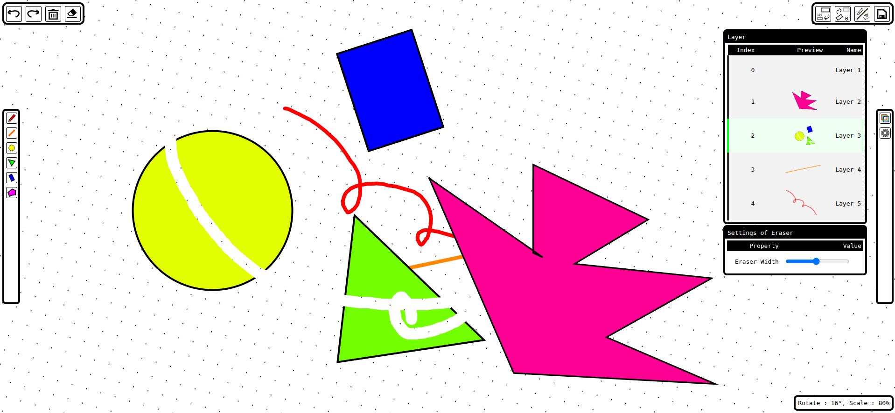

# About branch `features/interface-of-web-canvas`
Add a wrapper around canvas (konva.js / pixi.js)
1. Render data levels:
   1. Canvas: Similar to Konva's Stage
   2. Layer: Layer
   3. Shape: Rectangle, Circle, Path
2. Convert Line shape to Path

# MyLittlePaint-v2

A small painting application based on web canvas

* Previous Version: [MyLittlePaint](https://github.com/cycpe950609/MyLittlePaint)

# Features

* Rotatable/ Scalable canvas
* Drawing with Stylus (tested on iPad only)
* Multiple Layers
* Basic painting tools
    * Brush
    * Line
    * Circle / Triangle / Rectangle
* Drawing Polygons keep relative to the users' eyes

# TODO

* [ ] Layer manager (Create/Visibility/Delete/Merge)
* [ ] More size of canvas
    * [ ] Infinite Canvas
* [ ] Group of layers
* [ ] More tools
    * [ ] Paint Bucket
    * [ ] Text
* [ ] Use LocalStorage to prevent accidentally closing